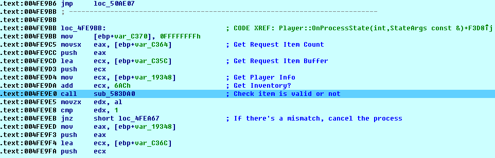
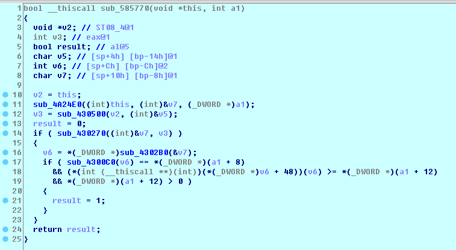
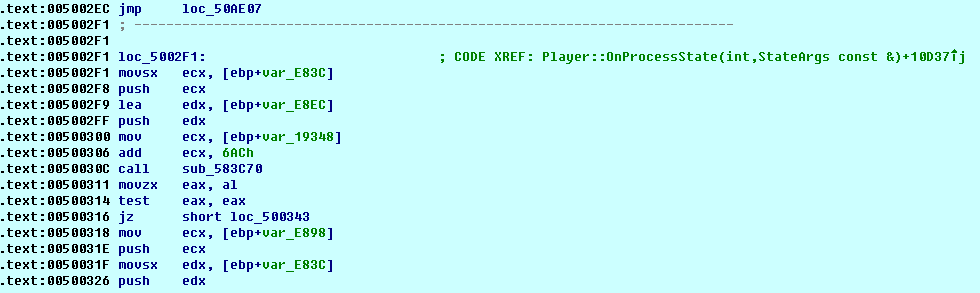
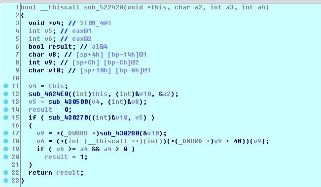
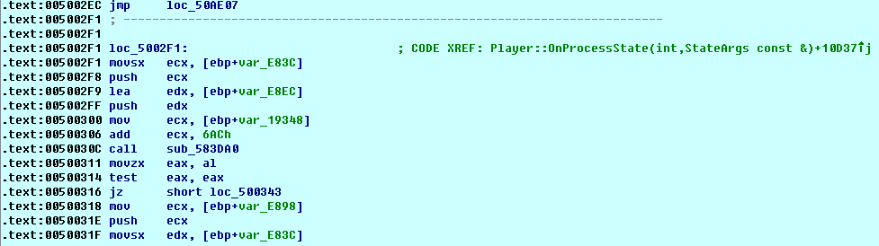

# Problem discovery

## Why this bug happens
Basically, it's caused by bad logic code. Let's figure out when using the compound function.

When the player clicks the compound button, the server verifies that given item info is correct or not.

Okay, this seems to be work well. But, how about the exchange function?  
  

It looks to perform to do the same thing. However...

Did you notice the difference? The server doesn't check the original item IDs. It just checks if the item UID is in player inventory or not.

## Fix it!
So we change it to check the original item ID also.

To make it easy, we just replace this with the compound function.

Gotcha! The problem is solved.
